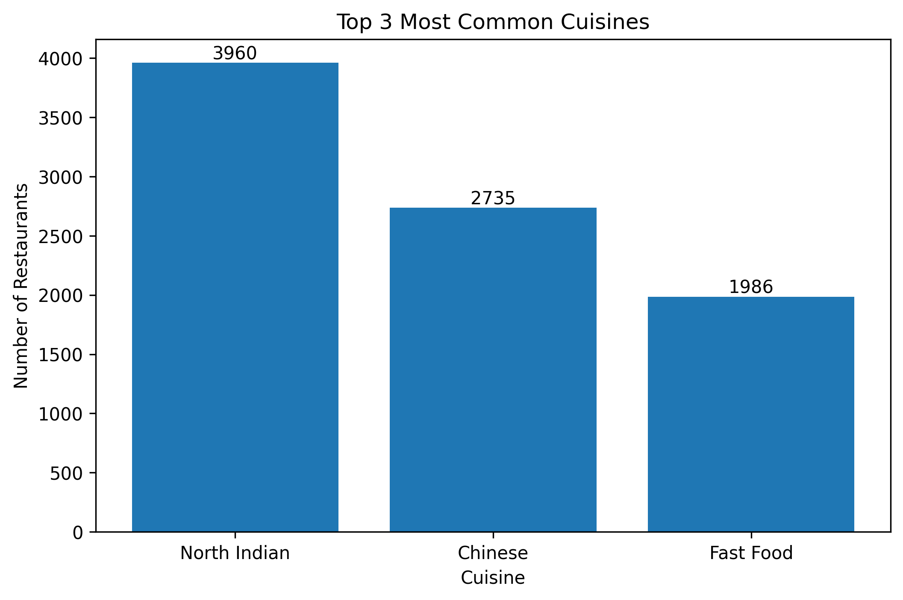
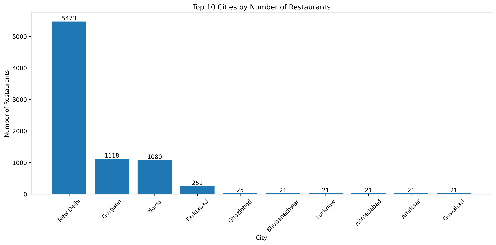
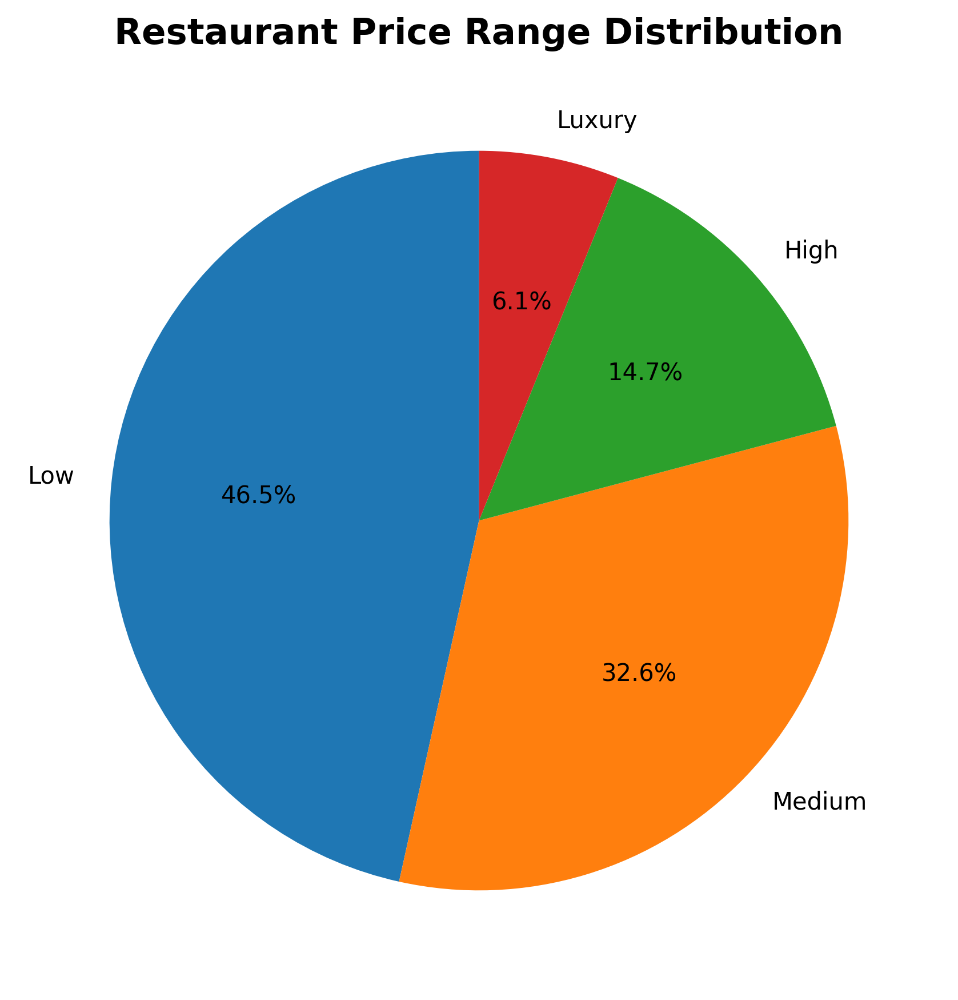
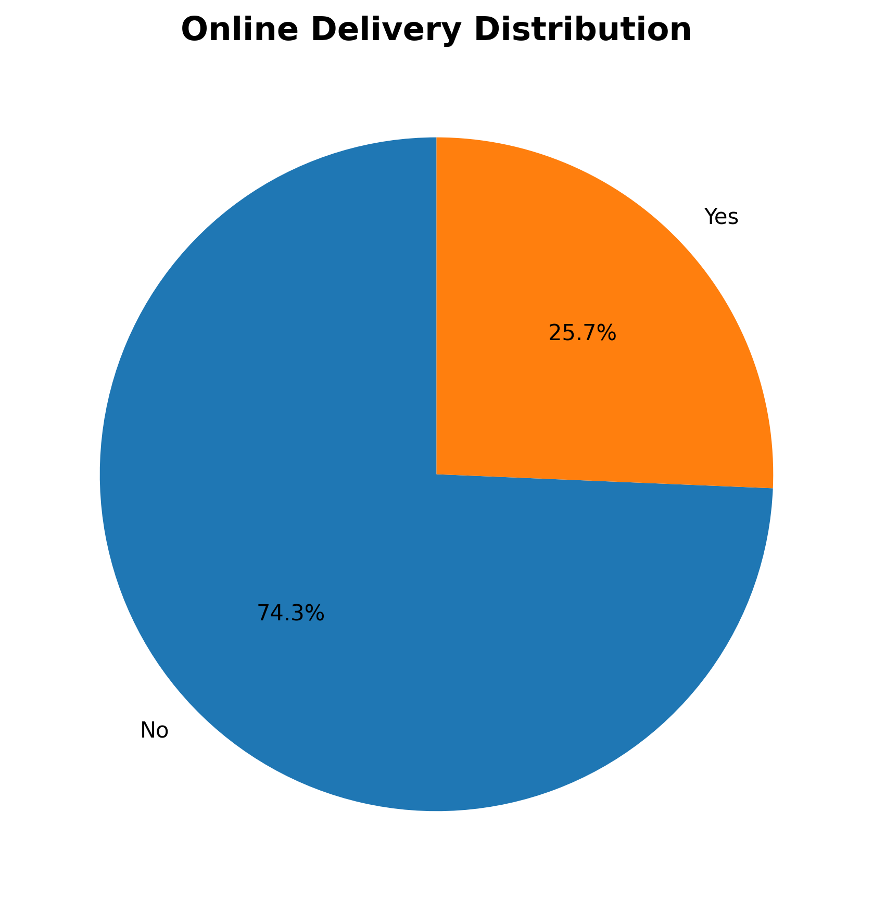
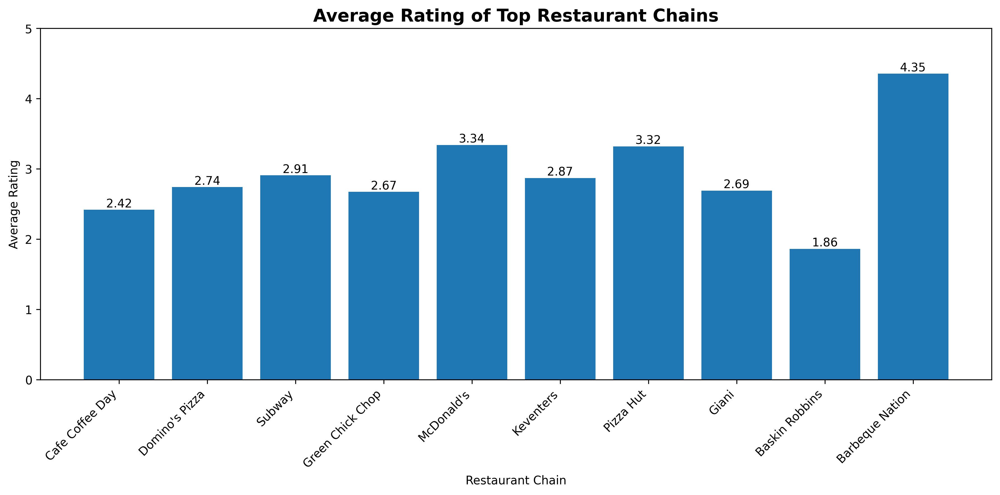

# 🍽️ Restaurant Data Analysis using Python

## 📌 Project Overview

This project analyzes a restaurant dataset containing information about restaurant names, cuisines, cities, ratings, price ranges, online delivery, table booking, votes, and other business-related features.

The objective of this project is to perform **Exploratory Data Analysis (EDA)** to uncover patterns, generate business insights, and visualize trends in the restaurant industry.

---

## 🎯 Objectives

- Perform data cleaning and preprocessing.
- Analyze popular cuisines.
- Study restaurant distribution across cities and countries.
- Explore price range distribution.
- Compare restaurants with and without online delivery.
- Analyze customer ratings and votes.
- Generate business insights using data visualization.

---

## 🛠️ Technologies Used

- Python
- Pandas
- NumPy
- Matplotlib
- Seaborn
- Jupyter Notebook

---

## 📂 Dataset Information

The dataset contains **9,551 restaurants** and **21 features**, including:

- Restaurant Name
- Country Code
- City
- Cuisines
- Average Cost for Two
- Currency
- Price Range
- Aggregate Rating
- Rating Text
- Votes
- Has Online Delivery
- Has Table Booking
- Latitude & Longitude

---

# 🧹 Data Cleaning

The following preprocessing steps were performed:

- Checked for duplicate records.
- Identified missing values.
- Filled missing cuisine values with `"Unknown"`.
- Removed duplicate entries.
- Verified data types and dataset structure.

---

# 📊 Level 1 Analysis

## Task 1: Top Cuisines

### Analysis Performed
- Extracted individual cuisines.
- Calculated cuisine frequencies.
- Identified top cuisines.

### Key Findings
- North Indian cuisine is the most common cuisine.
- Chinese cuisine is the second most popular.
- Fast Food ranks third.

---

## Task 2: City Analysis

### Analysis Performed
- Counted restaurants by city.
- Calculated average ratings by city.
- Visualized top cities.

### Key Findings
- New Delhi contains the highest number of restaurants.
- Inner City achieved the highest average rating.

---

## Task 3: Price Range Distribution

### Analysis Performed
- Counted restaurants in each price category.
- Calculated percentages.
- Created bar and pie charts.

### Key Findings
- Most restaurants belong to Price Range 1.
- Higher price ranges contain fewer restaurants.

---

## Task 4: Online Delivery

### Analysis Performed
- Compared restaurants offering online delivery.
- Calculated average ratings.

### Key Findings
- Restaurants with online delivery have higher average ratings.
- Approximately 25% of restaurants offer online delivery.

---

# 📈 Level 2 Analysis

## Task 1: Restaurant Ratings

### Analysis Performed
- Rating distribution analysis.
- Rating category classification.
- Average votes calculation.

### Key Findings
- Most restaurants fall in the "Good" rating category.
- Average restaurant rating is approximately 2.67.

---

## Task 2: Cuisine Combination Analysis

### Analysis Performed
- Most common cuisine combinations.
- Highest-rated cuisine combinations.

### Key Findings
- North Indian cuisine combinations dominate the dataset.
- Several niche cuisine combinations achieved ratings above 4.0.

---

## Task 3: Geographic Analysis

### Analysis Performed
- Country-wise restaurant distribution.
- Geographic restaurant spread using latitude and longitude.

### Key Findings
- India dominates the dataset.
- The United States ranks second in restaurant count.

---

## Task 4: Restaurant Chains

### Analysis Performed
- Identified restaurant chains.
- Compared outlet counts.
- Compared average ratings.

### Key Findings
- Cafe Coffee Day has the highest number of outlets.
- Barbeque Nation achieved the highest average rating among major chains.

---

# 📊 Level 3 Analysis

## Task 1: Restaurant Reviews & Ratings

### Analysis Performed
- Rating category analysis.
- Votes by rating category.
- Correlation between ratings and votes.

### Key Findings
- Excellent-rated restaurants receive significantly more votes.
- Positive correlation exists between ratings and customer engagement.

---

## Task 2: Votes Analysis

### Analysis Performed
- Identified most voted restaurants.
- Examined relationship between votes and ratings.

### Key Findings
- Highly rated restaurants generally receive more votes.
- Popular restaurants often maintain ratings above 4.0.

---

## Task 3: Price Range vs Online Delivery & Table Booking

### Analysis Performed
- Online delivery across price ranges.
- Table booking across price ranges.
- Average ratings by price range.
- Average votes by online delivery.

### Key Findings
- Higher-priced restaurants tend to receive higher ratings.
- Table booking is more common among premium restaurants.
- Restaurants offering online delivery receive more customer votes.

---

# 📌 Business Insights

1. North Indian cuisine dominates the restaurant market.
2. New Delhi has the highest restaurant concentration.
3. Budget-friendly restaurants are the most common.
4. Online delivery positively impacts customer engagement.
5. Premium restaurants tend to receive better ratings.
6. Table booking services are more prevalent in higher price categories.
7. Restaurant popularity and ratings show a positive relationship.

---
# 📷 Project Visualizations

## Top Cuisines

## City Analysis

## Price Range Distribution

## Online Delivery Analysis

## Restaurant Chains Analysis

# 🚀 Future Improvements

- Build an interactive dashboard using Power BI or Streamlit.
- Perform sentiment analysis on customer reviews.
- Develop a restaurant recommendation system.
- Predict restaurant ratings using Machine Learning.

---

# 📷 Sample Visualizations

- Top Cuisines
- City Distribution
- Price Range Distribution
- Online Delivery Analysis
- Restaurant Ratings
- Votes Analysis
- Restaurant Chains Analysis

---
# 📷 Project Visualizations

# 👨‍💻 Author

**Anil Yadav**

B.Tech Artificial Intelligence & Data Science

Mumbai University

---

## ⭐ Support

If you found this project useful, please consider giving it a star on GitHub.
